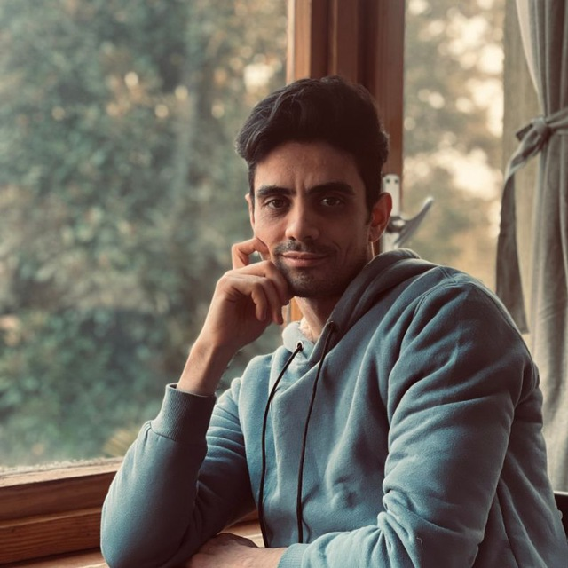
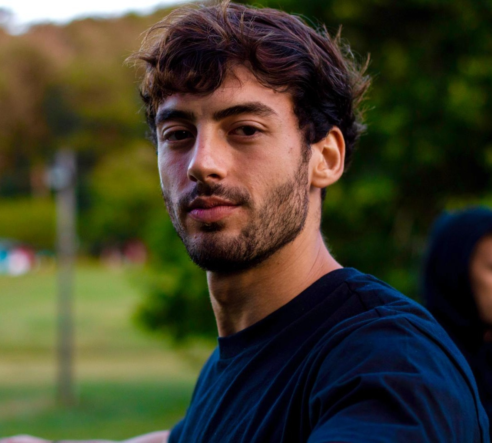
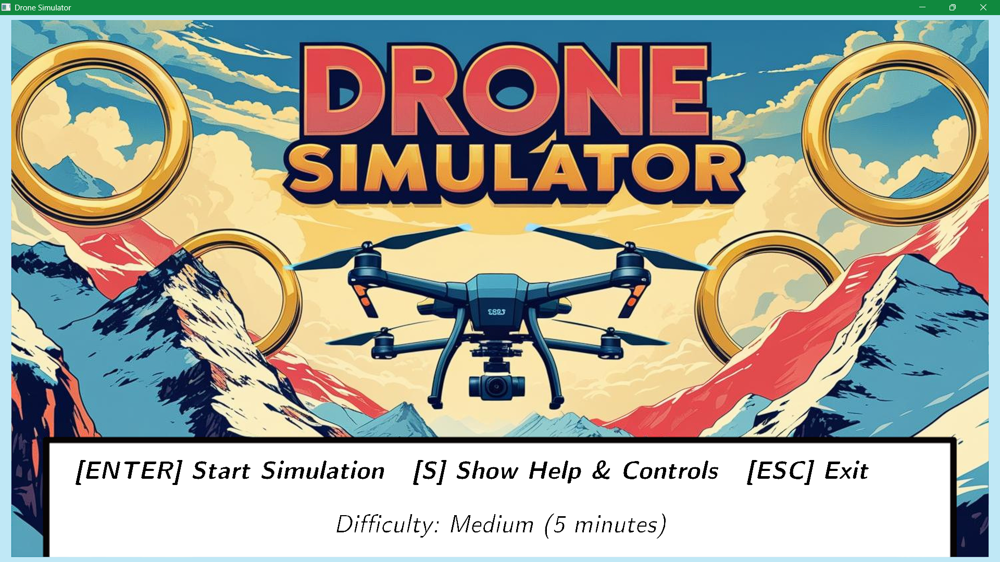
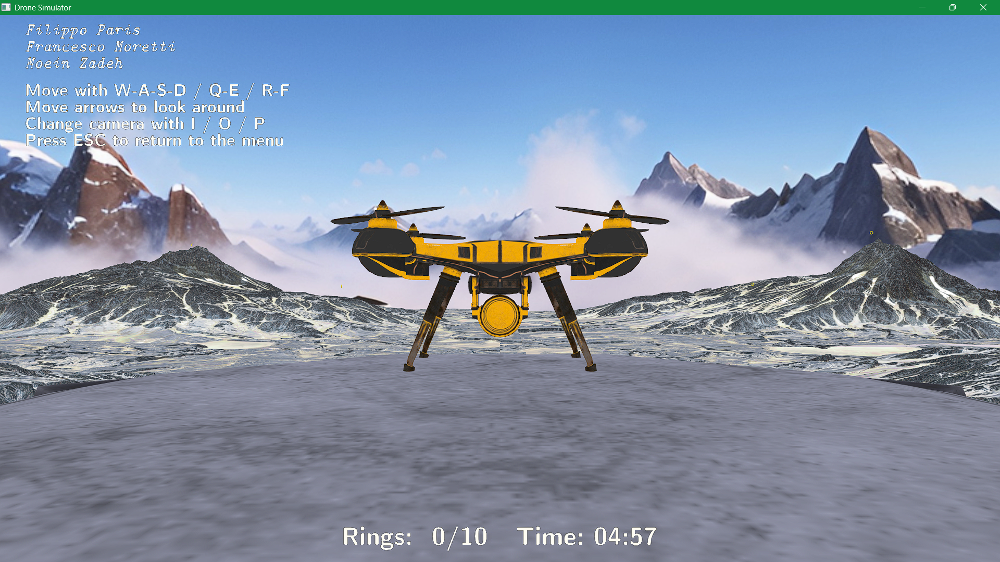
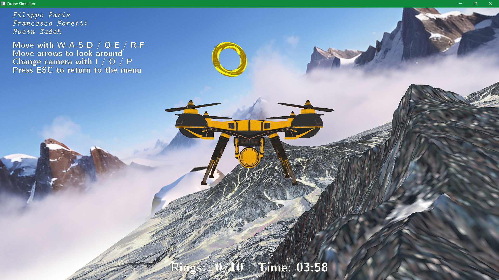

# DRONE SIMULATOR

**Computer Graphics 2024/25 – Politecnico di Milano**


## About Us
### Meet Our Team

<table style="width:100%; table-layout:fixed;">
  <tr>
    <td style="width:33.33%; text-align:center; vertical-align:top;">
      <br>
      <h4>Moein PeyghambarZadeh</h4>
      <p>MSc in Geoinformatics Engineering @POLIMI<br>BSc in Computer Engineering @Shdu</p>
      <p>
        <a href="mailto:seyed.peyghambar@mail.polimi.it">Mail</a> |
        <a href="https://github.com/moeinp70" target="_blank">GitHub</a> |
        <a href="https://www.linkedin.com/in/moein-peyghambarzadeh/" target="_blank">LinkedIn</a>
      </p>
    </td>
    <td style="width:33.33%; text-align:center; vertical-align:top;">
      <br>
      <h4>Filippo Paris</h4>
      <p>MSc in Music & Acoustic Engineering @POLIMI<br>BSc in Computer Engineering @UniBo</p>
      <p>
        <a href="mailto:filo.paris@gmail.com">Mail</a> |
        <a href="https://github.com/fparismusic" target="_blank">GitHub</a> |
        <a href="http://www.linkedin.com/in/filippoparis" target="_blank">LinkedIn</a>
      </p>
    </td>
    <td style="width:33.33%; text-align:center; vertical-align:top;">
      <br>
      <h4>Francesco Moretti</h4>
      <p>MSc in Music & Acoustic Engineering @POLIMI</p>
      <p>
        <a href="mailto:morettifra.23@gmail.com">Mail</a> |
        <a href="https://github.com/fra-moretti" target="_blank">GitHub</a> |
        <a href="https://www.linkedin.com/in/francesco-moretti-0853852aa/" target="_blank">LinkedIn</a>
      </p>
    </td>
  </tr>
</table>


## Table of Contents
1. [Overview](#overview)  
2. [Key Features](#key-features)  
3. [How to Install](#how-to-install)  
4. [Getting Started](#getting-started)  
5. [Technologies Behind the Game](#technologies-behind-the-game)  
6. [Code Architecture](#code-architecture)  
7. [Visual Preview](#visual-preview)  
8. [License & Usage Terms](#license--usage-terms)

---

## Overview  
**Drone Simulator** is a 3D interactive game developed using **Vulkan** and **C++** in **CLion**, designed as part of the Computer Graphics course.  
The objective is to control a drone and pass through **10 golden rings** within a time limit. This experience emphasizes spatial awareness, control precision, and timing.  

---

## Key Features  
- **Drone Control** via keyboard (`WASD`, `QE`, `RF`, arrow keys)  
- **Four terrain mountains** serve as the simulation environment  
- **10 golden rings** to collect, disappearing when passed through  
- **Start station** and animated drone model  
- **On-screen HUD** with:
  - Timer  
  - Collected ring counter  
  - Victory/defeat screen  
- **Skybox** with dynamic lighting  
- Multiple difficulty levels and responsive controls  

---

## How to Install  

### Requirements  
- Vulkan SDK (latest version - shaders use `#version 450`) 
- CMake ≥ 3.10 
- Git  
- C++17 compatible compiler (GCC, Clang, MSVC)  
- Compatible OS: **Windows**, **Linux**, **macOS**

---

### Installation Steps  
```bash
git clone https://github.com/fparismusic/ComputerGraphics-Project.git
cd DroneSimulator
mkdir build
cd build
cmake ..
make
./DroneSimulator
```
All required assets (models, textures, shaders) are included in the repository.
External libraries and course-provided files (Starter.hpp, Scene.hpp, TextMaker.hpp) are already integrated.


### 🚨 Large Asset Warning (IMPORTANT!)

Some models used in this project are **large in size (>100 MB)** and are tracked using **[Git LFS (Large File Storage)](https://git-lfs.com/)**.  
If you **don’t install Git LFS before cloning**, some model files in `assets/models/` will appear as text pointer files and your build will fail or show missing objects.

#### ✅ Option 1: Recommended — Install Git LFS

Before cloning:
```bash
git lfs install
git clone https://github.com/fparismusic/ComputerGraphics-Project.git
cd DroneSimulator
```

If you already cloned without LFS:
```bash
git lfs pull
```

#### ❗ Option 2: Manual Download (Fallback)

If you don’t want to use Git LFS, you can manually download the large model files and copy them to the correct folder:

- Download from: [This link](https://polimi365-my.sharepoint.com/:u:/g/personal/10921320_polimi_it/ESDgeFUEgidBlSUjMjbmvgABdfU8JRuGcLWcVQfHBKFaFA?e=T8anWd)   
- Then copy the files to:

```
assets/models/
```

---

## Getting Started

### Controls
- `W` / `A` / `S` / `D` → Move forward/backward/left/right  
- `Q` / `E` → Rotate left/right  
- `R` / `F` → Ascend/descend  
- Arrow Keys → Adjust orientation  

### Goal
Fly through **10 golden rings** as fast as possible.

### Win Condition
All rings collected before time runs out.

### Lose Condition
Time expires before collecting all rings.

---

## Technologies Behind the Game

- Vulkan – real-time graphics API  
- Phong shading model  
- Physically Based Rendering (PBR)  
- Skybox with environment mapping  
- HUD via TextMaker and images 
- JSON-based scene loading  
- Shader-driven ring disappearance logic  
- Multiple difficulty levels  
- Real-time ring counter and timer   
- Course-provided headers: `Starter.hpp`, `Scene.hpp`, `TextMaker.hpp`

---

## Code Architecture

- The main game class `DroneSimulator` inherits from `BaseProject`  
- Scene is defined in external `.json` files
  
### Core Lifecycle Methods

| Method | Purpose |
|--------|---------|
| `setWindowParameters()` | Define window size, title, and vsync settings |
| `onWindowResize(int w, int h)` | Handle viewport and framebuffer adjustments on window resize |
| `localInit()` | Load Vulkan models and textures, initialize Descriptor Set Layouts, load shaders |
| `pipelinesAndDescriptorSetsInit()` | Create Vulkan pipelines and descriptor sets |
| `pipelinesAndDescriptorSetsCleanup()` | Destroy pipelines and descriptor sets (temporary) |
| `localCleanup()` | Fully destroy models, textures, layouts and pipelines |
| `populateCommandBuffer()` | Record all drawing commands to be submitted to the GPU |
| `updateUniformBuffer()` | Update camera, lighting and game-related uniforms each frame |

### Drone Game-Specific Logic

| Method | Description |
|--------|-------------|
| `setCameraMode(GLFWwindow*)` | Switch between different camera modes |
| `getDroneInput(GLFWwindow*, float deltaT)` | Handle real-time drone controls via keyboard |
| `updateGlobalUBO(GlobalUniformBufferObject&, float elapsedTime)` | Change lighting color dynamically over time |
| `reset()` | Reset the game state after win/lose |
| `loadMountainPoints(std::vector<glm::vec3>&)` | Extract mountain geometry to detect collisions |
| `isTooCloseToMountain(...)` | Prevent drone from clipping into terrain |
| `checkRingPassage(...)` | Detect if the drone successfully passed through a ring |

- Assets and textures are included in the `assets/models` and `assets/textures` folder, sourced from Sketchfab  
- Rendering pipelines:
  - **Phong** shading for environment (e.g., terrain)  
  - **PBR** rendering for the drone model  
  - **Skybox**  
- Live updates on:
  - Elapsed time  
  - Collected rings  
  - Win/lose state

---

## Visual Preview

*Figure 1: Game menu.*



*Figure 2: Drone at start.*



*Figure 3: Flying drone with ring.*

---

## License & Usage Terms
DRONE-SIMULATOR © 2025 All Rights Reserved. 
No part of this project may be reproduced, copied, or used for commercial or academic purposes without explicit permission from the authors.

This game was developed as an academic project for educational purposes only.
